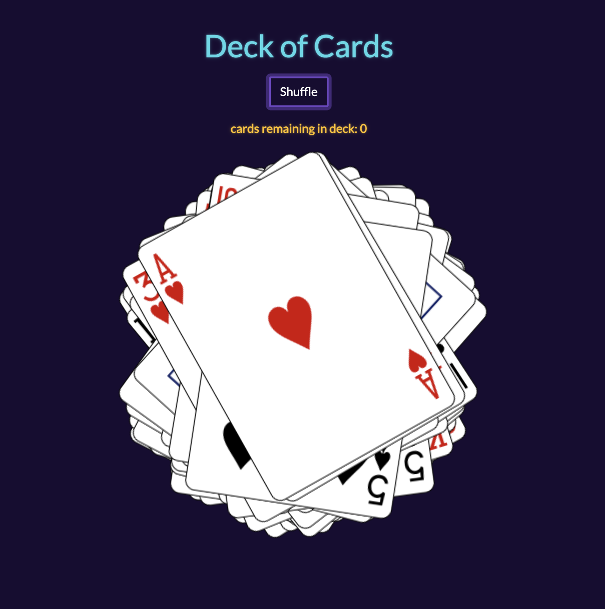

# **Deck of Cards**

## **Overview**

The main feature of this application is to draw a random card from a deck. Once all the cards have been revealed, a user can shuffle the deck to show a new arrangement of cards.

## **API**

This application was created using data from the [<ins>**Deck of Cards API**</ins>](http://deckofcardsapi.com). All facts are sourced from the API's database.

## Technologies Used:

- [HTML](https://developer.mozilla.org/en-US/docs/Web/HTML)
- [CSS](https://developer.mozilla.org/en-US/docs/Web/CSS)
- [jQuery](https://api.jquery.com)
- [VSCode](https://code.visualstudio.com/docs)
- [Bootswatch](https://bootswatch.com/vapor/)
